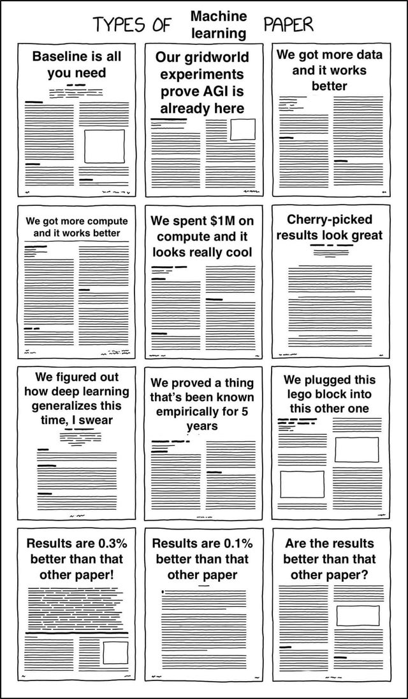

 

> As I'm now working as a research intern, I understand more the complexity of research and how far-fetched it can be.

## How to read a research paper ?

When you read a research paper, you need to be **active**. You need to write down how the algorithm works, what is taken as input, what is the ouput and how they manage to process everything. Don't worry about evil mathematics formula, it's completly normal to be lost. You don't have to **understand everything**.

I take between **3 to 4 hours** to read a paper, when it is not a huge one. It may happend that I take a day to read only one paper. And don't start mentionning thesis... I took an entire day to read a 300 pages one the other day and my head is still burning. 

Start reading the abstract to have an overview of the topic and understand what the authors are doing. Then, read the introduction because it will give you a larger overview of the project. Read the conclusion, it will summarize everything that has been written in the paper. It is relevant to understand why and how they did what they did. The choice is yours for the rest, you can read results and the methodology or do the opposite. With this, you can understand better how authors did their job and what results they obtained. You can add it to your benchmark and even test it if they provide the source code.

 
<i>Type of machine learnings papers according to a reddit user</i>

## Why researcher code is hard to read ?

First of all, when we speak about research in the field of artificial intelligence, I immediatly think about code. Why ? Well, because it is not always common to acceed to open source code if the paper is still under review and because it is sometimes hard to read and understand properly. In this article, I will try to understand why and explain it.

The key performance indicators for researchers are all about paper publications. You need to be the first to publish your innovative paper and you don't have time to clean everything at the right time. The code provided is just proof-of-concepts.

Remember that most researchers are not programmers ! Or they're specialized in one language, which can be another one that the one they're programing in. They might not realize when refactoring is necessary.

In fact, at the early stage of deep learning, there was not really documentation on how to build a good model or how to write efficient code in Python with Tensorflow, PyTorch or whatever other library.